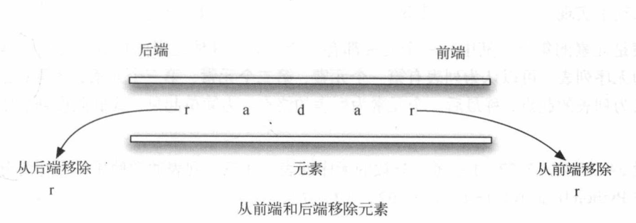

[TOC]

**谨以此篇博文，记录我学习 《Python数据结构与算法分析第二版》的重点，本文质量欠佳，重点请参考超链接参考内容。**

[pdf与书籍中相关代码下载链接（无习题答案无习题代码）](https://lgl1227404395.lanzoue.com/iCOVP0kcozif)

课程请观看陈斌老师在B站的视频，链接如下

[第7周【课堂实录7-1】递归(下)内容小结；贪心策略与动态规划；慕课W06作业详解_哔哩哔哩_bilibili](https://www.bilibili.com/video/BV1gy4y1E7M5/?p=56&spm_id_from=pageDriver&vd_source=2d5a45edbbac80f264cf29291496d923)

[数据结构与算法Python版 自学课程指南](https://www.bilibili.com/read/cv17415452)

**习题与oj参考答案（仅供参考）**

[(9条消息) 数据结构与算法（Python版）_Divine0的博客-CSDN博客](https://blog.csdn.net/divine0/category_9795160.html)

[(9条消息) 数据结构与算法_猪脚王的博客-CSDN博客](https://blog.csdn.net/weixin_47004540/category_10529232.html)

## **栈**

### **栈的结构与操作定义**

Stack()创建一个空栈。它不需要参数，且会返回一个空栈。
push(item)将一个元素添加到栈的顶端。它需要一个参数item，且无返回值。
pop()将栈顶元素移除。它不需要参数，但会返回栈顶端的元素，且修改栈的内容。
peek()返回栈顶端的元素，但并不移除该元素。不需要参数，且不修改栈的内容。
isEmpty()检查栈是否为空。它不需要参数，且会返回一个布尔值。
size()返回栈中元素的数目。它不需要参数，且会返回一个整数。

Python列表时有序集合，它提供了一整套方法。所以我们只需要确定哪一边视为栈顶即可。一旦确定了顶端，所有的操作就可利用append和pop等列表方法来实现。

```python
class Stack:
    # 构造方法
    def __init__(self):
        self.item = []
    # 栈判空
    def isEmpty(self):
        return self.item == []
    # 入栈
    def push(self, item):
        self.item.append(item)
    # 出栈
    def pop(self):
        return self.item.pop()
    # 取栈顶元素
    def peek(self):
        return self.item[len(self.item) - 1]
    # 栈的长度,也就是栈中元素的数目
    def size(self):
        return len(self.item)

# 定义对象s,实例化类Stack
# s = Stack()

# 判空
# print(s.isEmpty())

# 入栈
# print(s.push(4))
# print(s.push('dog'))
# print(s.push(True))

# 出栈
# print(s.pop())

# 栈的大小
# print(s.size())

#取栈顶元素,但不移除
# print(s.peek())
```

### **栈的应用之算术表达式的括号匹配**

由一个空栈开始，从左往右依次处理括号。如果遇到左括号，便通过push操作将其加入栈中，以此表示稍后需要有一个与之匹配的右括号。反之，如果遇到右括号，就调用pop操作。只要栈中的所有左括号都能遇到与之匹配的右括号，那么整个括号串就是匹配的。反之，则括号串不匹配。如果括号串是匹配的，在处理完后，栈应该是空的。

```python
class Stack:
    # 构造方法
    def __init__(self):
        self.item = []
    # 栈判空
    def isEmpty(self):
        return self.item == []
    # 入栈
    def push(self, item):
        self.item.append(item)
    # 出栈
    def pop(self):
        return self.item.pop()
    # 取栈顶元素
    def peek(self):
        return self.item[len(self.item) - 1]
    # 栈的长度,也就是栈中元素的数目
    def size(self):
        return len(self.item)

def parChecker(symbolString):
    """
    检测括号串是否匹配
    :param symbolString:一串字符串类型的括号串
    :return: 是否匹配
    """
    s = Stack()
    balance = True
    index = 0
    while index < len(symbolString) and balance:
        symbol = symbolString[index]
        if symbol in "([{":
            s.push(symbol)
        else: # 当扫到右括号时
            if s.isEmpty():
                balance = False
            else: # 当扫到右括号,且栈不为空时,需要判定栈顶的左括号与扫到的右括号是否匹配.
                top = s.pop()
                if not matches(top, symbol):
                    balance = False
        index = index + 1
    if balance and s.isEmpty():
        return True
    else:
        return False

def matches(open, close):
    """
    匹配两个字符.比如 ( 只能与 ) 匹配.
    :param open:字符1
    :param close:字符2
    :return: 两个字符是否匹配
    """
    opens = "([{"
    closers = ")]}"
    return opens.index(open) == closers.index(close)
```

### **栈的应用之中缀表达式转后缀表达式**

对于**（A+B）* C**，它对应的后缀表达式为**A B + C  ***。从左往右看，首先出现的运算符是**+**。不过，由于括号改变了运算符的优先级，因此当处理到*时，+已经被放入结果表达式中了。

现在可以来总结转换算法：

当遇到左括号时，需要将其保存，以表示接下来会遇到高优先级的运算符；那个运算符需要等到对应的右括号出现时才能确定其位置；当右括号出现时，便可以将运算符从栈中取出来。

从左往右扫描中中缀表达式时，利用栈来保存运算符。栈顶永远时最新添加的运算符。每当遇到一个新的运算符时，都需要对比它与栈中运算符的优先级。

假设中缀表达式是一个以空格分隔的标记串，其中没运算符标记由*、/、+和-，括号标记由（和），操作数标记由A、B、C等。

(1)创建用于保存运符符的空栈opstack, 以及一个用于保存结果的空列表。
(2)使用字符串方法split将输入的中序表达式转换成一个列表。
(3)从左往右扫描这个标记列表。
	· 如果标记是操作数，将其添加到结果列表的末尾。
	· 如果标记是左括号， 将其压入opstack栈中。
	· 如果标记是右括号， 反复从opstack栈中移除元索， 直到移除对应的左括号。将从栈中取出的每一个运符符都添加到结果列表的末尾。
	· 如果标记是运算符，将其压入opstack栈中。但是， 在这之前， 需要先从栈中取出优先级更高或相同的运算符， 并将它们添加到结果列表的末尾。
(4)处理完输入表达式以后， 检查opstack。将其中所有残留的运算符全部添加到结果列表的末尾。


```python
import string
from Stack import Stack

def infixToPostfix(infixexpr):
    """
    中缀表达式转后缀表达式
    :param infixexpr: 中缀表达式
    :return: 后缀表达式
    """
    prec = {} # 定义prec字典来保存运算符的优先级值,把每一个运算符的优先级映射为一个整数.
    prec["*"] = 3
    prec["/"] = 3
    prec["+"] = 2
    prec["-"] = 2
    prec["("] = 1

    opStack = Stack()
    postfixList = []

    tokenList = infixexpr.split()
    for token in tokenList:
        if token in string.ascii_uppercase: # ascii_uppercase = 'ABCDEFGHIJKLMNOPQRSTUVWXYZ'
            postfixList.append(token)
        elif token == '(':
            opStack.push(token)
        elif token == ')':
            topToken = opStack.pop()
            while topToken != '(':
                postfixList.append(topToken)
                topToken = opStack.pop()
        else:
            while(not opStack.isEmpty() and (prec[opStack.peek()] >= prec[token])):
                postfixList.append(opStack.pop())
            opStack.push(token)
    while not opStack.isEmpty():
        postfixList.append(opStack.pop())
    # print(postfixList)
    return " ".join(postfixList)

infixToPostfix("( A + B ) * ( C + D )")
```

## 队列

### **队列的结构与操作定义**

队列的操作和结构定义
Queue()创建一个空队列。它不需要参数，且会返回一个队列。
enqueue(item)在队列的尾部添加一个元素。它需要一个元素作为参数，不返回任何值
dequeue()从队列的头部移除一个元素。它不需要参数，且会返回一个元素，并修改队列的内容。
isEmpty()检查队列是否为空。它不需要参数，且会返回一个布尔值。
size()返回队列中元素的数目。它不需要参数，且会返回一个整数。

```python
class Queue:
    def __init__(self):
        self.items = []

    def isEmpty(self):
        return self.items == []

    def enqueue(self, item):
        self.items.insert(0, item)

    def dequeue(self):
        return self.items.pop()

    def size(self):
        return len(self.items)
```

### **队列的应用之传土豆**（约瑟夫环问题）

使用队列来模拟一个环。假设握着土豆的孩子位于队列的头部。在模拟传土豆的过程中，程序会将这个孩子的名字移出队列，然后立刻将其插入队列的尾部。随后这个孩子会一直等待，直到再次到达队列的头部。在出列和入列nums次后，此时位于队列头部的孩子出局，新一轮游戏开始。如此反复，直到队列中只剩下一个名字（队列的大小为1）。

```python
from Queue import Queue
# 传土豆--约瑟夫环问题
def hotPotato(namelist, num):
    simqueue = Queue()
    for name in namelist:
        simqueue.enqueue(name)
    while simqueue.size() > 1:
        for i in range(num):
            simqueue.enqueue(simqueue.dequeue())
        print("每次传土豆移出环的人：", simqueue.dequeue())
    return simqueue.dequeue()

print(hotPotato(["Bill", "David", "Susan","Jane","Kent","Brad"], 7))
```

## 双端队列

### **双端队列的结构与操作定义**

Deque()创建一个空的双端队列。它不需要参数，且会返回一个空的双端队列。
addFront(item)将一个元素添加到双端队列的前端。它接受一个元素作为参数，没有返回值。
addRear(item)将一个元素添加到双端队列的后端。它接受一个元素作为参数，没有返回值。
removeFront()从双端队列的前端移除一个元素。它不需要参数，且会返回一个元素，并修改双端队列的内容。
removeRear()从双端队列的后端移除一个元素。它不需要参数，且会返回一个元素，并修改双端队列的内容。
isEmpty()判空 它不需要参数，且会返回一个布尔值。
size()返回双端队列中元素的数目。它不需要参数，且会返回一个整数。

```python
class Deque:
    def __init__(self):
        self.items = []

    def isEmpty(self):
        return self.items == []

    def addFront(self, item):
        self.items.append(item)

    def addRear(self, item):
        self.items.insert(0, item)

    def removeFront(self):
        return self.items.pop()

    def removeRear(self):
        return self.items.pop(0)

    def size(self):
        return len(self.items)
```

### **双端队列的应用之回文检测器**

利用双端队列从前后端移除元素，因此比较两个元素，并且只有在二者相等的时候才继续。如果一直匹配第一个和最后一个元素，最终会处理完所有字符（如果字符是偶数），或者只有一个元素的双端队列（字符是奇数）。任意一种结果都表明输入的字符串是回文串。



```python
from Deque import Deque

def palcheck(astring):
    chardeque = Deque()
    for i in astring:
        chardeque.addFront(i)

    stillEqual = True
    while chardeque.size() > 1 and stillEqual:
        first = chardeque.removeFront()
        last = chardeque.removeRear()
        if first != last:
            stillEqual = False

    return stillEqual
```

上述数据结构都是借用Python中的列表来实现的。并非所有的编程语言都由列表，对于不提供列表的编程语言，程序员必须手动实现。列表是元素的集合，其中每一个元素都有一个相对于其他元素的位置。更具体的来说，这种列表成为无序列表。

## **无序列表**

### **无序列表的抽象数据类型定义与实现**

List()创建一个空列表。它不需要参数，且会返回一个空列表。
add(item)假设元素item之前不在列表中，并向其中添加item。它接受一个元素作为参数，无返回值。
remove(item)假设元素item在列表中，从中移除item。它接受一个元素作为参数，并修改列表。
search(item)在列表中搜索元素item。它接受一个元素作为参数，且返回布尔值。
isEmpty()判空。它不需要参数，并且返回一个布尔值。
length()求列表中元素的个数，也就是表长。它不需要参数，并且返回一个整数。
append(item)假设元素item之前不在列表中，向表尾添加item。它接受一个元素作为参数，无返回值。
index(item)假设元素item已经在列表中，并返回该元素在列表中的位置。它接受一个元素作为参数，并且返回该元素的下标。
insert(pos, item)假设元素item不在列表中，同时假设pos是合理的值，并在位置pos处添加元素item。接受两个参数，无返回值。
pop()假设列表不空，并从列表中移除最后一个元素。不需要参数，且会返回一个元素。
pop(pos)假设在指定位置pos处存在元素，并移除该位置上的元素。它接受位置参数，且会返回一个元素。

```python
# 链表实现无序列表
# 定义Node类
class Node:
    def __init__(self, initdata):
        self.data = initdata # 节点的数据域
        self.next = None     #  节点的指针域

    # 获得节点数据域中存放的数据
    def getData(self):
        return self.data

    # 获得节点指针域所指向的下一个节点
    def getNext(self):
        return self.next

    # 修改节点数据与中的数据
    def setData(self, newData):
        self.data = newData

    # 修改节点指针域指向的下一个节点
    def setNext(self, newnext):
        self.next = newnext

# 无序链表UnorderedList类的构造方法
class UnorderedList:
    def __init__(self):
        self.head = None
        self.mlength = 0
    # 判空
    def isEmpty(self):
        return self.head == None
    # 从头添加
    def add(self, item):
        temp = Node(item) # 为新数据创建一个节点，并赋值给临时变量temp
        temp.setNext(self.head) # 将新创建的节点指向头节点
        self.head = temp        # 修改头节点的指向，将头节点指向创建的
        self.mlength += 1
    # 求长度
    def length(self):
        current = self.head
        count = 0
        while current != None: # 从头节点开始往后扫，遍历整个链表
            count = count + 1
            current = current.getNext()

        return count
    # 查找元素
    def search(self, item):
        current = self.head
        found = False
        while current != None and not found:
            if current.getData() == item:
                found = True
            else:
                current = current.getNext()

        return found
    # 删除元素
    def remove(self, item):
        current = self.head
        previous = None
        found = False
        while not found:
            if current.getData() == item:
                found = True
            else:
                previous = current
                current = current.getNext()
        # 如果要删除的元素在头节点，只需修改头节点的指向即可
        if previous == None:
            self.head = current.getNext()
        else:# 如果删除的元素不在头节点，将current指针指向元素 的前一个元素的指针(previous) 指向current的后一个元素即可
            previous.setNext(current.getNext())
        self.mlength -= 1

    # 从列表尾部添加元素
    def append(self, item):
        current = self.head
        while current.getNext():# 当头节点不指向None时，current指针后移
            current = current.getNext()
        current.setNext(item.head)# current从最后一个元素指向新元素
    # 查找元素，返回元素的索引
    def index(self, item):
        idx = 0
        current = self.head
        while current and current.getData() != item:
            current = current.getNext()
            idx += 1
        if not current: # 当current指针指到None时，说明遍历了整个链表都没找到要找的元素
            return -1
        return idx
    # 从列表尾部删除元素
    def pop(self):
        current = self.head
        if not self.mlength: # 如果链表长度为0
            print("空列表，无法弹出元素")
            return
        previous = None
        while current.getNext(): # 从头节点开始往后扫
            previous = current
            current = current.getNext()
        if not previous:# 即链表中只有一个元素，即头节点指向的元素时。将头节点指向为空，表长减1。
            self.head = None
            self.mlength -= 1
            return current.getData()
        else:
            previous.setNext(None)
            self.mlength -= 1
            return current.getData()
    # 按索引插入元素
    def insert(self, pos, item):
        if pos < 0:
            return "索引错误"
        if pos == 0:
            self.add(item)
            return
        current = self.head
        pos -= 1
        while current and pos:
            current = current.getNext()
            pos -= 1
        newNode = Node(item)
        nex = current.getNext()
        current.setNext(newNode)
        newNode.setNext(nex)
        self.mlength += 1

    def length2(self):
        return self.mlength
    # 删除指定位置的元素
    def pop(self, pos):
        current = self.head
        pre = None
        pos -= 1
        while current:
            if self.index(current.getData) != pos:
                pre = current
                current = current.getNext()
                pos -= 1
            else:
                pre = current.getNext()
                return current.getData()
        self.length -= 1
```

## **有序列表**

### **有序列表的抽象数据类型定义与实现**

```python
class Node:
    def __init__(self, initdata):
        self.data = initdata
        self.next = None

    def getData(self):
        return self.data

    def getNext(self):
        return self.next

    def setData(self, newData):
        self.data = newData

    def setNext(self, newNext):
        self.next = newNext

class OrderedList:
    def __init__(self):
        self.head = None
        self.mlength = 0

    def isEmpty(self):
        return self.head == None

    def length(self):
        current = self.head
        count = 0
        while current:
            count += 1
            current = current.getNext()
        return count

    # 因为列表是有序的,当扫到比item要大的元素时,直接返回查询失败,后续元素不用扫描.(按值递增排序的列表)
    def search(self, item):
        current = self.head
        found = False
        stop = False
        while current != None and not found and not stop:
            if current.getData() == item:
                found = True
            else:
                if current.getData() > item:
                    stop = True
                else:
                    current = current.getData()
        return found
    # 因为列表是有序的,当扫到比item大的元素a时,previous指针指向a的前一个元素.
    def add(self, item):
        current = self.head
        previous = None
        stop = False
        while current != None and not stop:
            if current.getData() > item:
                stop = True
            else:
                previous = current
                current = current.getNext()
        temp = Node(item)
        if previous == None:
            temp.setNext(self.head)
            self.head = temp
        else:
            temp.setNext(current)
            previous.setNext(temp)
    # 删除元素
    def remove(self, item):
        current = self.head
        previous = None
        found = False
        while not found:
            if current.getData() == item:
                found = True
            else:
                previous = current
                current = current.getNext()
        # 如果要删除的元素在头节点，只需修改头节点的指向即可
        if previous == None:
            self.head = current.getNext()
        else:# 如果删除的元素不在头节点，将current指针指向元素 的前一个元素的指针(previous) 指向current的后一个元素即可
            previous.setNext(current.getNext())
        self.mlength -= 1

    # 查找元素，返回元素的索引
    def index(self, item):
        idx = 0
        current = self.head
        while current and current.getData() != item:
            current = current.getNext()
            idx += 1
        if not current: # 当current指针指到None时，说明遍历了整个链表都没找到要找的元素
            return -1
        return idx

    # 从列表尾部删除元素
    def pop(self):
        current = self.head
        if not self.mlength: # 如果链表长度为0
            print("空列表，无法弹出元素")
            return
        previous = None
        while current.getNext(): # 从头节点开始往后扫
            previous = current
            current = current.getNext()
        if not previous:# 即链表中只有一个元素，即头节点指向的元素时。将头节点指向为空，表长减1。
            self.head = None
            self.mlength -= 1
            return current.getData()
        else:
            previous.setNext(None)
            self.mlength -= 1
            return current.getData()

    def length2(self):
        return self.mlength
    # 删除指定位置的元素
    def pop(self, pos):
        current = self.head
        pre = None
        pos -= 1
        while current:
            if self.index(current.getData) != pos:
                pre = current
                current = current.getNext()
                pos -= 1
            else:
                pre = current.getNext()
                return current.getData()
        self.length -= 1
```

## **递归**

```python
# 循环求和函数
def listnum(numList):
    theSum = 0
    for i in numList:
        theSum = theSum + i
    return theSum

# 循环求和函数的递归写法
def listnum(numList):
	if len(numlist) == 1:
		return numList[0]
    else:
        return numList[0] + listsum(numList[1:])
```

### **递归三原则**

（1）递归算法必须有**基本情况**

（2）递归算法必须改变其状态并向基本情况靠近

（3）递归算法必须递归地调用自己

### **递归应用之整数转2~16为进制基础的字符串**

```python
# 递归应用之整数转2~16为进制基础的字符串
def toStr(n, base):
    covertString = "0123456789ABCDEF"
    if n < base:
        return covertString[n]
    else:
        return toStr(n//base, base) + covertString[n%base]
```

```python
# 栈帧实现递归，把字符串压入栈中
rStack = Stack()
def toStr(n, base):
    covertString = "0123456789ABCDEF"
    if n < base:
        return rStack.push(covertString[n])
    else:
		rStack.push(covertString(n%base))
        toStr(n//base, base)
```

```python
# 递归可视化 绘制螺旋线
from turtle import *

myTurtle = Turtle()
myWin = myTurtle.getscreen()

def drawSpiral(myTurtle, lineLen):
    if lineLen > 0:
        myTurtle.forward(lineLen)
        myTurtle.right(90)
        drawSpiral(myTurtle, lineLen-5)
drawSpiral(myTurtle, 100)
myWin.exitonclick()
```

```python
from turtle import *

t = Turtle()
myWin = t.getscreen()

# 绘制分形树
def tree(branchLen, t):
    if branchLen > 5:
        t.forward(branchLen)
        t.right(20)
        tree(branchLen-15, t)
        t.left(40)
        tree(branchLen-10, t)
        t.right(20)
        t.backward(branchLen)
tree(110, t)
myWin.exitonclick()
```

### **递归应用之汉诺塔问题**

借助一根中间柱子，将高度为height的一叠盘子从起点柱子移到终点柱子。

（1）借助终点柱子将高度为height - 1的一叠盘子移到中间柱子

（2）将最后一个盘子移到终点柱子

（3）借助起点柱子，将高度 为height - 1的一叠盘子从中间柱子移到终点柱子

```python
def moveTower(height, fromPole, toPole, withPole):
    """
    汉诺塔问题移动盘子
    :param height:盘子总数
    :param fromPole:起点柱子
    :param toPole:终点柱子
    :param withPole:中间柱子
    :return:
    """
    if height >= 1:
        moveTower(height-1, fromPole, withPole, toPole)
        moveDisk(fromPole, toPole)
        moveTower(height-1, withPole, toPole, fromPole)
def moveDisk(fromPole, toPole):
    """
    将最大的盘子从起点柱子移到终点柱子
    :param fromPole:起点柱子
    :param toPole:终点柱子
    :return:
    """
    print("moving disk from %d to %d\n" %(fromPole, toPole))
```

### **递归应用之迷宫问题**

1.从起始位置开始爬，首先向北移动一格，然后在新的位置再递归地重复本过程。

2.如果第一步向北行不通，就尝试向南移动一格，然后递归地重复本过程

3.如果向南也行不通，就尝试向西移动一格，然后递归地重复本过程。

4.如果向北、向西、向南都不行，就尝试向东移动一格，然后递归地重复本过程。

5.如果四个方向都不行，就意味着没有出路。

但上述方法存在问题，假设第一步向北移动一格，下一步也是向北移动一格。如果此时北面有墙，根据递归又会往南移动一格。这样又回到了原点，递归陷入了死循环。所以必须通过 一个策略来记住到过的地方。

假设小乌龟一边爬，一边丢面包屑。如果往某个方向走一格之后发现有面包屑，就知道应该立刻退回去，然后尝试递归过程的下一步。退回去也就是从递归函数调用中返回。

我们可以考虑到以下四种基本情况

（1）小乌龟遇到了墙。由于格子被堵住，因此无法再继续探索。
（2）小乌龟遇到了已经走过的格子。在这种情况下，我们不希望它继续探索，不然会陷入死循环。

（3）小乌龟找到了出口。

（4）四个方向都行不通。

_\_init_\_读入一个代表迷宫的数据文件，初始化迷宫的内部表示，并且找到小乌龟的起始位置。
drawMaze在屏幕上的一个窗口中绘制迷宫。
updatePosition更新迷宫的内部表示，并且修改小乌龟在迷宫中的位置。
isExit检查小乌龟的当前位置是否为迷宫的出口。
除此之外，Maze类还重载了索引运算符[],以便算法访问任何一格的状态。

```python
import turtle

PART_OF_PATH = 'O'
TRIED = '.'
OBSTACLE = '+'
DEAD_END = '-'

class Maze:
    def __init__(self,mazeFileName):
        rowsInMaze = 0
        columnsInMaze = 0
        self.mazelist = []
        mazeFile = open(mazeFileName,'r')
        rowsInMaze = 0
        for line in mazeFile:
            rowList = []
            col = 0
            for ch in line[:-1]:
                rowList.append(ch)
                if ch == 'S':
                    self.startRow = rowsInMaze
                    self.startCol = col
                col = col + 1
            rowsInMaze = rowsInMaze + 1
            self.mazelist.append(rowList)
            columnsInMaze = len(rowList)

        self.rowsInMaze = rowsInMaze
        self.columnsInMaze = columnsInMaze
        self.xTranslate = -columnsInMaze/2
        self.yTranslate = rowsInMaze/2
        self.t = turtle.Turtle()
        self.t.shape('turtle')
        self.wn = turtle.Screen()
        self.wn.setworldcoordinates(-(columnsInMaze-1)/2-.5,-(rowsInMaze-1)/2-.5,(columnsInMaze-1)/2+.5,(rowsInMaze-1)/2+.5)

    def drawMaze(self):
        self.t.speed(10)
        for y in range(self.rowsInMaze):
            for x in range(self.columnsInMaze):
                if self.mazelist[y][x] == OBSTACLE:
                    self.drawCenteredBox(x+self.xTranslate,-y+self.yTranslate,'orange')
        self.t.color('black')
        self.t.fillcolor('blue')

    def drawCenteredBox(self,x,y,color):
        self.t.up()
        self.t.goto(x-.5,y-.5)
        self.t.color(color)
        self.t.fillcolor(color)
        self.t.setheading(90)
        self.t.down()
        self.t.begin_fill()
        for i in range(4):
            self.t.forward(1)
            self.t.right(90)
        self.t.end_fill()

    def moveTurtle(self,x,y):
        self.t.up()
        self.t.setheading(self.t.towards(x+self.xTranslate,-y+self.yTranslate))
        self.t.goto(x+self.xTranslate,-y+self.yTranslate)

    def dropBreadcrumb(self,color):
        self.t.dot(10,color)

    def updatePosition(self,row,col,val=None):
        if val:
            self.mazelist[row][col] = val
        self.moveTurtle(col,row)

        if val == PART_OF_PATH:
            color = 'green'
        elif val == OBSTACLE:
            color = 'red'
        elif val == TRIED:
            color = 'black'
        elif val == DEAD_END:
            color = 'red'
        else:
            color = None

        if color:
            self.dropBreadcrumb(color)

    def isExit(self,row,col):
        return (row == 0 or
                row == self.rowsInMaze-1 or
                col == 0 or
                col == self.columnsInMaze-1 )

    def __getitem__(self,idx):
        return self.mazelist[idx]

def searchFrom(maze, startRow, startColumn):
    maze.updatePositon(startRow, startColumn)
    # 检查基本情况
    # 1.遇到墙
    if maze[startRow][startColumn] == OBSTACLE:
        return False
    # 2.遇到已经走过的格子
    if maze[startRow][startColumn] == TRIED:
        return False
    # 3.找到出口
    if maze.isExit(startRow,startColumn):
        maze.updatePosition(startRow, startColumn, PART_OF_PATH)
        return True
    maze.updatePosition(startRow, startColumn, TRIED)
    # 否则再依次尝试四个方向移动
    found = searchFrom(maze, startRow-1, startColumn) or \
            searchFrom(maze, startRow+1, startColumn) or \
            searchFrom(maze, startRow, startColumn-1) or \
            searchFrom(maze, startRow, startColumn+1)
    if found:
        maze.updatePosition(startRow, startColumn, PART_OF_PATH)
    else:
        maze.updatePosition(startRow, startColumn, DEAD_END)
    return found

# myMaze = Maze('maze2.txt')
# myMaze.drawMaze()
# myMaze.updatePosition(myMaze.startRow,myMaze.startCol)
# 
# searchFrom(myMaze, myMaze.startRow, myMaze.startCol)
```

maze2.txt

```txt
++++++++++++++++++++++
+   +   ++ ++        +
      +     ++++++++++
+ +    ++  ++++ +++ ++
+ +   + + ++    +++  +
+          ++  ++  + +
+++++ + +      ++  + +
+++++ +++  + +  ++   +
+          + + S+ +  +
+++++ +  + + +     + +
++++++++++++++++++++++
```

## **优化问题与贪心策略**

优化问题的一格经典例子就是在找零的时候使用最少的硬币。假设某个自动售货机制造商希望在每笔交易中给出最少的硬币，一个顾客使用一张一美元的纸币购买了价值37美分的物品，最少需要找给顾客多少硬币呢？答案是6枚：25美分的2枚，10美分的1枚，1美分的3枚。首先从面值最大的硬币（25美分）开始，使用尽可能多的硬币，然后尽可能多的使用价值第二大的硬币。这种方法就叫做**贪心策略**--试图最大程度的解决问题。

**贪心策略**

每次都试图解决问题的**尽量大**的一部分对应到兑换硬币问题，就是每次以**最多数量**的**最大面值**硬币来**迅速减少**找零面值

但是除了常见的1分、5分、10分和25分时，假设还有硬币的面值为21分时，那么贪心策略就没法正确的为找零63分的情况得出最少硬币数。而最优解是3枚21分的硬币。

```python
# 找零问题的递归解法
def recMC(coinValueList, change):
    minCoins = change
    if change in coinValueList:
        return 1
    else:
        for i in [c for c in coinValueList if c <= change]:
            numCoins = 1 + recMC(coinValueList, change-i)
            if numCoins < minCoins:
                minCoins = numCoins
    return minCoins

print(recMC([1,5,10,25],63))
```

```python
# 找零问题的优化解法
def recDC(coinValueList, change, knownResults):
    minCoins = change
    if change in coinValueList:# 递归结束条件
        knownResults[change] = 1 # 记录最优解
        return 1
    elif knownResults[change] > 0:
        return knownResults[change] #查表成功，直接最优解
    else:
        for i in [c for c in coinValueList if c <= change]:
            numCoins = 1 + recDC(coinValueList, \
                                 change-i, knownResults)
            if numCoins < minCoins:
                minCoins = numCoins
                # 找到最优解，记录到表中
                knownResults[change] = minCoins
    return minCoins

print(recDC([1, 5, 10, 25], 63, [0]*64))
```
## **动态规划**

```python
# 找零问题的动态规划解法
def dpMakeChange(coinValueList, change, minCoins):
    # 从1分开始到change逐个计算最少硬币数
   for cents in range(1,change+1):
       # 1.初始化一个最大值
        coinCount = cents
       # 2. 减去每个硬币，向后查最少硬币数，同时记录总的最少数
        for j in [c for c in coinValueList if c <= cents]:
            if minCoins[cents-j] + 1 < coinCount:
                coinCount = minCoins[cents - j] + 1
        # 3. 得到当前最少硬币数，记录到表中
        minCoins[cents] = coinCount
    # 返回最后一个结果
   return minCoins[change]
```

```python
# 找零问题的动态规划优化解法
def dpMakeChange(coinValueList,change,minCoins,coinsUsed):
   for cents in range(change+1):
      coinCount = cents
      newCoin = 1
      for j in [c for c in coinValueList if c <= cents]:
            if minCoins[cents-j] + 1 < coinCount:
               coinCount = minCoins[cents-j]+1
               newCoin = j
      minCoins[cents] = coinCount
      coinsUsed[cents] = newCoin
   return minCoins[change]

def printCoins(coinsUsed,change):
   coin = change
   while coin > 0:
      thisCoin = coinsUsed[coin]
      print(thisCoin)
      coin = coin - thisCoin

def main():
    amnt = 63
    clist = [1,5,10,21,25]
    coinsUsed = [0]*(amnt+1)
    coinCount = [0]*(amnt+1)

    print("Making change for",amnt,"requires")
    print(dpMakeChange(clist,amnt,coinCount,coinsUsed),"coins")
    print("They are:")
    printCoins(coinsUsed,amnt)
    print("The used list is as follows:")
    print(coinsUsed)

main()

```

## **搜索（查找）与排序**

### **顺序搜索**

#### **无序列表顺序搜索**


```python
def sequenttialSearch(alist, item):
    pos = 0 # 索引下标从0开始
    found = False
    while pos < len(alist) and not found:
        if alist[pos] == item:
            found = True
        else:
            pos += 1
    return found
```

#### **分析无序列表顺序搜索算法**

**顺序搜索算法的时间复杂度为O(n)**

对于搜索来说，统计比较次数是有意义的。每一次比较只有两个结果：要么找到目标元素，要么没有找到。假设列表中元素是无序的，也就是每个位置找到目标元素的可能性都是一样的。

表中元素为n个，顺序搜索要经过n次比较后才能确定目标元素不在列表中。

搜索成功的三种情况

​		1.最好情况：要找的目标元素在列表中第一个位置。只需比较1次。

​		2.最坏情况：目标元素位于最后一个位置，即需要比较n次。

​		3.普通情况：我们会在列表中间位置处找到目标元素，即需要比较n/2次。

搜索失败的三种情况

​		1.最好情况：要找的目标元素在列表中第一个位置。只需比较n次。

​		2.最坏情况：目标元素位于最后一个位置，即需要比较n次。

​		3.普通情况：我们会在列表中间位置处找到目标元素，即需要比较n次。


#### **有序列表顺序搜索**

```python
def orderedSequentialSearch(alist, item):
    pos = 0
    found = False
    stop = False
    while pos < len(alist) and not found and not stop:
        if alist[pos] == item:
            found = True
        else:
            if alist[pos] > item:
                stop = True
            else:
                pos += 1
    return found
```

#### **分析有序列表顺序搜索算法**

**顺序搜索算法的时间复杂度为O(n)**

有序列表在搜索不存在的元素时，效率会得到提高。

搜索失败的情况

​		1.最好情况：要找的目标元素在列表中第一个位置。只需比较1次。

​		2.最坏情况：目标元素位于最后一个位置，即需要比较n次。

​		3.普通情况：我们会在列表中间位置处找到目标元素，即需要比较n/2次。


### **二分搜索**


#### **有序列表的二分搜索**

```python
# 有序列表是升序
def binarySearch(alist, item):
    first = 0
    last = len(alist) - 1
    found = False
    while first <= last and not found:
        midpoint = (first + last) // 2
        if alist[midpoint] == item:
            found = True
        else:
            if item < alist[midpoint]:
                last = midpoint - 1
            else:
                first = midpoint + 1
    return found
```

#### **二分搜索的递归版本**

```python
def binarySearch(alist, item):
    if len(alist) == 0:
        return False
    else:
        midpoint = len(alist) // 2
        if alist[midpoint] == item:
            return True
        else:
            if item < alist[midpoint]:
                return binarySearch(alist[:midpoint],item)
            else:
                return binarySearch(alist[midpoint+1:],item)
```

#### **分析二分搜索算法**

**二分搜索算法的时间复杂度为O(log n)**


### **散列**

#### **散列表**


#### **载荷因子**


#### **冲突**


#### **散列函数**


**散列函数的取法**

1.**直接取余法**

顾名思义，直接取余。h(item) = item % size

**2.折叠法**


**3.平方取中法**


```python
# 为字符串构建简单的散列函数
def hash(astring, tablesize):
    sum = 0
    for pos in range(len(astring)):
        sum = sum + ord(astring[pos])
    return sum % tablesize
```

但是，针对异序词，这个散列函数总能得到相同的散列值。比如'cat'与'tac'。要弥补这一点，可以用字符位置作为权重因子。


```python
def hash(astring, tablesize):
    sum = 0
    for pos in range(len(astring)):
        w = pos + 1 # 添加权重因子
        sum = sum + ord(astring[pos]) * w
    return sum % tablesize
```

#### **处理冲突**


**1.线性探测与开放定址法**


整数集合（54,26,93,17,77,31,44,55,20）


线性探测有个缺点，就是会使散列表出现**聚集**现象。也就是说，如果一个槽发生太多冲突，线性探测会填满其附近的槽，这样会影响到后续插入的元素。在尝试插入元素20时，要越过数个散列值为0的元素才能找到一个空槽。


**2.再散列**


**3.平方探测**


**4.链接法**


**实现映射抽象数据类型**


```python
class HashTable:
    def __init__(self):
        self.num = 0
        self.size = 11
        self.solts = [None] * self.size # 存放键
        self.data = [None] * self.size  # 存放值

    def put(self, key, data):
        hashvalue = self.hashfunction(key, len(self.solts))# 计算元素的哈希值
        if self.solts[hashvalue] == None: # 以哈希值为索引的列表为None
            self.num += 1
            self.solts[hashvalue] = key # 填入键
            self.data[hashvalue] = data # 填入值
        else: #以哈希值为索引的列表不是None
            if self.solts[hashvalue] == key: #存放这个键的列表中的元素与这个键相等
                self.data[hashvalue] = data # 更新存放值的列表中与这个键相对应的值
            else:#以哈希值为索引的列表不是None，且存放这个键的列表中的元素与这个键不相等，说明出现了冲突
                nextslot = self.rehash(hashvalue, len(self.solts))# 再散列解决冲突
            while self.solts[nextslot] != None and \
                    self.solts[nextslot] != key:
                nextslot = self.rehash(nextslot, len(self.solts))
            if self.solts[nextslot] == None:
                self.num += 1
                self.solts[nextslot] = key
                self.data[nextslot] = data
            else:
                self.data[nextslot] = data

    def hashfunction(self, key, size):
        return key % size

    def rehash(self, oldhash, size):
        return (oldhash + 1) % size

    def get(self, key):
        startslot = self.hashfunction(key, len(self.solts))
        data = None
        stop = False
        found = False
        positon = startslot
        while self.solts[positon] != None and \
            not found and not stop:
            if self.solts[positon] == key:
                found = True
                data = self.data[positon]
            else:#self.solts[postion]不为空，没有直接找到与key对应的data，说明出现了冲突
                positon = self.rehash(positon, len(self.solts))
                if positon == startslot:# 当重新扫到起始的哈希计算的位置时，说明整个表都扫了一边都没找到元素
                    stop = True
        return data

    def __getitem__(self, key):
        return self.get(key)

    def __setitem__(self, key, data):
        self.put(key, data)

    def __len__(self):
        return self.num
    
    def hashdel(self, key):
        hashvalue = self.hashfunction(key, len(self.slots))
        if self.solts[hashvalue] == None:
            return
        else:
            self.solts[hashvalue] = None
            self.data[hashvalue] = None
```

#### **分析散列搜索算法**


### **冒泡排序**

**时间复杂度O(n^2)**


```python
def bubbleSort(alist):
    length = len(alist)
    for i in range(length):
        for j in range(length-i-1):
            if alist[j] > alist[j+1]:
                # temp = alist[j]
                # alist[j] = alist[j+1]
                # alist[j+1] = temp
                alist[j],alist[j+1] = alist[j+1],alist[j]
```


```python
# 短冒泡-在待派序列是有序时，终止排序
def shortBubbleSort(alist):
    exchanges = True
    passnum = len(alist) - 1
    while passnum > 0 and exchanges:
        exchanges = False
        for i in range(passnum):
            if alist[i] > alist[i+1]:
                exchanges = True
                alist[i],alist[i+1] = alist[i+1],alist[i]
        passnum = passnum - 1
```

### **选择排序**

**时间复杂度O(n^2)**


```python
# range参数
# start: 计数从 start 开始。默认是从 0 开始
# stop: 计数到 stop 结束，但不包括 stop
# step：步长，默认为1。
# python 默认的range是左闭右开区间，当步长为负时，变为左开右闭区间
def selectionSort(alist):
    for fillslot in range(len(alist)-1,0,-1):
        positonOfMax = 0
        for location in range(1, fillslot+1):
            if alist[location] > alist[positonOfMax]:
                positonOfMax = location
        alist[fillslot],alist[positonOfMax] = alist[positonOfMax], alist[fillslot]
```


### **插入排序**

**时间复杂度O(n^2)**


```python
# 插入排序
def insertSort(alist):
    for index in range(1, len(alist)):
        currentvalue = alist[index]
        positon = index
        while positon > 0 and alist[positon-1] > currentvalue:
            alist[positon] = alist[positon-1]
            positon = positon - 1
        alist[positon] = currentvalue
    return alist
print(insertSort([54,26,93,17,77,31,44,55,20]))
```


### **希尔排序**

**时间复杂度为**
$$
O(n^\frac{3}{2})
$$


```python
#希尔排序
def shellSort(alist):
    sublistcount = len(alist) // 2
    while sublistcount > 0:
        for startposition in range(sublistcount):
            gapInsertionSort(alist, startposition, sublistcount)
        print("After increments of size", sublistcount, "The list is", alist)
        sublistcount = sublistcount // 2
def gapInsertionSort(alist, start, gap):
    for i in range(start+gap, len(alist), gap):
        currentvalue = alist[i]
        position = i
        while position >= gap and \
            alist[position-gap] > currentvalue:
            alist[position] = alist[position-gap]
            position = position-gap
        alist[position] = currentvalue

```


### **归并排序**

**时间复杂度O(nlogn)**


```python
#归并排序
def mergeSort(alist):
    print("Splitting ", alist)
    if len(alist) > 1:
        mid = len(alist) // 2
        lefthalf = alist[:mid]
        righthalf = alist[mid:]

        mergeSort(lefthalf)
        mergeSort(righthalf)

        i=0
        j=0
        k=0
        while i < len(lefthalf) and j < len(righthalf):
            if lefthalf[i] < righthalf[j]:
                alist[k] = lefthalf[i]
            else:
                alist[k] = righthalf[j]
                j = j + 1
            k = k + 1
        while i < len(lefthalf):
            alist[k] = lefthalf[i]
            i = i + 1
            k = k + 1
        while j < len(righthalf):
            alist[k] = righthalf[j]
            j = j + 1
            k = k + 1
    print("Merging ", alist)
```


### **快速排序**

**时间复杂度最好O(nlogn) 最坏O(n^2)**


```python
#快速排序
def quickSort(alist):
    quickSortHelper(alist, 0, len(alist)-1)

def quickSortHelper(alist, first, last):
    if first < last:
        splitpoint = partition(alist, first, last)
        quickSortHelper(alist, first, splitpoint-1)
        quickSortHelper(alist, splitpoint-1, last)

def partition(alist, first, last):
    pivotvalue = alist[first]
    leftmark = first + 1
    rightmark = last
    done = False
    while not done:
        while leftmark <= rightmark and \
            alist[leftmark] <= pivotvalue:
            leftmark = leftmark + 1
        while alist[rightmark] >= pivotvalue and \
            rightmark >= leftmark
            rightmark = rightmark - 1
        if rightmark < leftmark:
            done = True
        else:
            alist[leftmark],alist[rightmark] = alist[rightmark],alist[leftmark]
    alist[first],alist[rightmark] = alist[rightmark],alist[first]
    return rightmark
```


### **基数排序**

**时间复杂度为**

基数排序(Radix Sort)是一种非比较型整数排序算法，是桶排序的扩展。基本思想是：将所有待比较数值统一为同样的数位长度，数位较短的数前面补零。按照低位先排序，分别放入10个队列中，然后采用先进先出的原则进行收集；再按照高位排序，然后再收集；依次类推，直到最高位，最终得到排好序的数列。对于数值偏小的一组序列，其速度是非常快的，时间复杂度达到了线性，而且思想也非常的巧妙。

#### **算法实现步骤**

1. 取得数组中的最大数，并取得位数；
2. 对数位较短的数前面补零；
3. 分配，先从个位开始，根据位值(0-9)分别放到0~9号桶中;
4. 收集，再将放置在0~9号桶中的数据按顺序放到数组中;
5. 重复3~4过程，直到最高位，即可完成排序。

```python
from typing import List

def radix_sort(arr:List[int]):
    n = len(str(max(arr)))  # 记录最大值的位数
    for k in range(n):#n轮排序
        # 每一轮生成10个列表
        bucket_list=[[] for i in range(10)]#因为每一位数字都是0~9，故建立10个桶
        for i in arr:
            # 按第k位放入到桶中
            bucket_list[i//(10**k)%10].append(i)
        # 按当前桶的顺序重排列表
        arr=[j for i in bucket_list for j in i]
    return arr

# 测试数据

if __name__ == '__main__':
    import random
    random.seed(54)
    arr = [random.randint(0,100) for _ in range(10)]
    print("原始数据：", arr)
    arr_new = radix_sort(arr)
    print("计数排序结果为：", arr_new)

# 输出结果

原始数据： [17, 56, 71, 38, 61, 62, 48, 28, 57, 42]
计数排序结果为： [17, 28, 38, 42, 48, 56, 57, 61, 62, 71]
```


[(8条消息) 十大经典排序算法的复杂度分析_阿尔兹的博客-CSDN博客_十大排序算法时间复杂度](https://blog.csdn.net/alzzw/article/details/98100378)

**非线性时间比较类排序**：通过比较来决定元素间的相对次序，由于其[时间复杂度](https://so.csdn.net/so/search?q=时间复杂度&spm=1001.2101.3001.7020)不能突破O(nlogn)，因此称为非线性时间比较类排序。

**线性时间非比较类排序**：不通过比较来决定元素间的相对次序，它可以突破基于比较排序的时间下界，以线性时间运行，因此称为线性时间非比较类排序


### **小结**


## **树**

### **树的定义**


**树的实现**

分为两种。第一种，**列表之列表**，其实就是递归。第二种，**节点与引用**。

BinaryTree()创建一个二叉树实例

getLeftChild()返回当前节点的左子节点所对应的二叉树

getRightChile()返回当前节点的右子节点对应的二叉树

setRootVal(val)在当前节点中存储参数val中的对象

getRootVal()返回当前节点存储的对象

insertLeft(val)新建一棵二叉树，并将其作为当前节点的左子节点

insertRight(val)新建一棵二叉树，并将其作为当前节点的右子节点

```python
# 树的实现 列表之列表
def BinaryTree(r):
    return [r, [], []]

def insertLeft(root, newBranch):
    t = root.pop(1)
    if len(t) > 1:
        root.insert(1, [newBranch, t, []])
    else:
        root.insert(1, [newBranch, [], []])
    return root

def insertRight(root, newBranch):
    t = root.pop(2)
    if len(t) > 1:
        root.insert(2,[newBranch, [], t])
    else:
        root.insert(2, [newBranch, [], []])
    return root
# 树的访问函数
def getRootVal(root):
    return root[0]

def setRootVal(root, newVal):
    root[0] = newVal

def getLeftChild(root):
    return root[1]

def getRightChild(root):
    return root[2]
```


```python
# 树的实现 节点与引用
class BinaryTree:
    def __init__(self, rootobj):
        self.key = rootobj
        self.leftChild = None
        self.rightChild = None

    def insertLeft(self, newNode):
        if self.leftChild == None:
            self.leftChild = BinaryTree(newNode)
        else:
            t = BinaryTree(newNode)
            t.leftChild = self.leftChild
            self.leftChild = t
    def insertRight(self, newNode):
        if self.rightChild == None:
            self.rightChild = BinaryTree(newNode)
        else:
            t = BinaryTree(newNode)
            t.rightChild = self.rightChild
            self.rightChild = t
    # 二叉树的访问函数
    def getRightChild(self):
        return self.rightChild
    def getLeftChild(self):
        return self.leftChild
    def setRootVal(self, obj):
        self.key = obj
    def getRootVal(self):
        return self.key
    # 二叉树的访问函数
    def getRightChild(self):
        return self.rightChild
    def getLeftChild(self):
        return self.leftChild
    def setRootVal(self, obj):
        self.key = obj
    def getRootVal(self):
        return self.key
```

### **二叉树的应用**

1.构建解析树

（（7+3）*（5-2））


```python
# 构建解析树
class Stack:
    def __init__(self):
        self.item = []

    def isEmpty(self):
        return self.item == []

    def push(self, item):
        self.item.append(item)

    def pop(self):
        return self.item.pop()

    def peek(self):
        return self.item[len(self.item) - 1]

    def size(self):
        return len(self.item)

class BinaryTree:
    def __init__(self, rootobj):
        self.key = rootobj
        self.leftChild = None
        self.rightChild = None

    def insertLeft(self, newNode):
        if self.leftChild == None:
            self.leftChild = BinaryTree(newNode)
        else:
            t = BinaryTree(newNode)
            t.leftChild = self.leftChild
            self.leftChild = t
    def insertRight(self, newNode):
        if self.rightChild == None:
            self.rightChild = BinaryTree(newNode)
        else:
            t = BinaryTree(newNode)
            t.rightChild = self.rightChild
            self.rightChild = t
    # 二叉树的访问函数
    def getRightChild(self):
        return self.rightChild
    def getLeftChild(self):
        return self.leftChild
    def setRootVal(self, obj):
        self.key = obj
    def getRootVal(self):
        return self.key
# 计算二叉解析树的递归函数
def evaluate(parseTree):
    opers = {'+':operator.add, '-':operator.sub, '*':operator.mul, '/':operator.truediv}
    leftC = parseTree.getLeftChild()
    rightC = parseTree.getRightChild()

    if leftC and rightC:
        fn = opers[parseTree.getRootVal()]
        return fn(evaluate(leftC), evaluate(rightC))
    else:
        return parseTree.getRootVal()

```

### **树的遍历**


```python
# 树的遍历之前序遍历的递归实现
def preorder(tree):
    if tree:
        print(tree.getRootVal())
        preorder(tree.getLeftVal())
        preorder(tree.getRightVal())

```

```python
#树的遍历之前序遍历的非递归实现
def preorder(self):
    print(self.key)
    if self.leftChild:
        self.left.preorder()
        if self.rightChild:
            self.right.preoder()
```

```python
# 树的后序遍历的递归实现
def postorder(tree):
    if tree != None:
        postorder(tree.getLeftChild())
        postorder(tree.getRightChild())
        print(tree.getRootVal())
```

```python
#树的遍历之中序遍历的递归实现
def inorder(tree):
    if tree:
        inorder(tree.getLeftVal())
        print(tree.getRootVal())
        inorder(tree.getRightVal())
```

### **利用二叉堆实现优先级队列**


**二叉堆的方法**

BinaryHeap()新建一个空的二叉堆

insert(k)往堆中加入一个新元素

findMin()返回最小的元素，元素留在堆中

delMin()返回最小的元素，并将该元素从堆中移除

isEmpty()在堆为空时返回True，否则返回False

size()返回堆中元素的个数

buildHeap(list)根据一个列表创建堆

**二叉堆的实现**


为了维持堆的有序性，只需交换根节点与它的最小子节点即可。重复节点与子节点的交换过程，直到节点比其两个子节点都小。


```python
# 二叉堆的实现
class BinaryHeap:
    def __init__(self):
        self.heapList = [0]
        self.currentSize = 0
    def percUp(self, i):
        while i // 2 > 0:
            if self.heapList[i] < self.heapList[i // 2]:# 要插入的节点小于父节点
                tmp = self.heapList[i // 2]
                self.heapList[i // 2] = self.heapList[i]
                self.heapList[i] = tmp
            i = i // 2
    def insert(self, k):
        self.heapList.append(k)
        self.currentSize = self.currentSize + 1
        self.percUp(self.currentSize)

    def delMin(self):
        retval = self.heapList[1]
        self.heapList[1] = self.heapList[self.currentSize]
        self.currentSize = self.currentSize - 1
        self.heapList.pop()
        self.percDown(1)
        return retval
    def percDown(self, i):
        while (i * 2) <= self.currentSize:
            mc = self.minChild(i)
            if self.heapList[i] > self.heapList[mc]:
                tmp = self.heapList[i]
                self.heapList[i] = self.heapList[mc]
                self.heapList[mc] = tmp
            i = mc
    def minChild(self, i):
        if i * 2 + 1 > self.currentSize:
            return i * 2
        else:
            if self.heapList[i*2] < self.heapList[i*2+1]:
                return i * 2
            else:
                return i * 2 + 1
    # 根据元素列表构建堆
    def buildHeap(self, alist):
        i = len(alist) // 2
        self.currentSize = len(alist)
        self.heapList = [0] + alist[:]
        while (i > 0):
            self.percDown(i)
            i = i - 1
```

### **二叉搜索树**


**搜索树的实现**


插入方法有个重要的问题是，不能正确的处理重复的键。遇到重复的键时，会在已有节点的右子树中创建一个具有同样键的节点。这样做的结果就是搜索时永远发现不了较新的键。

要处理重复键的插入，更好的做法是用关联的新值替换旧值。


```python
# 二叉搜索树
class BinarySearchTree:
    def __init__(self):
        self.root = None
        self.size = 0

    def length(self):
        return self.size

    def __len__(self):
        return self.size

    def __iter__(self):
        return self.root.__iter__()
class TreeNode:
    def __init__(self, key, val, left=None, right=None, parent=None):
        self.key = key
        self.payload = val
        self.leftChild = left
        self.rightChild = right
        self.parent = parent

    def hasLeftChild(self):
        return self.leftChild

    def hasRightChild(self):
        return self.rightChild

    def isLeftChild(self):
        return self.parent and self.parent.leftChild == self

    def isRightChild(self):
        return self.parent and self.parent.rightChild == self

    def isRoot(self):
        return not self.parent

    def isLeaf(self):
        return not (self.rightChild or self.leftChild)


    def hasAnyChildren(self):
        return self.rightChild or self.leftChild

    def hasBothChildren(self):
        return self.rightChild and self.leftChild

    def replaceNodeData(self,key,value,lc,rc):
        self.key = key
        self.payload = value
        self.leftChild = lc
        self.rightChild = rc
        if self.hasLeftChild():
            self.leftChild.parent = self
        if self.hasRightChild():
            self.rightChild.parent = self
    def put(self, key, val):
        if self.root:
            self._put(key, val, self.root)
        else:
            self.root = TreeNode(key, val)
        self.size = self.size + 1
    def _put(self, key, val, currentNode):
        if key < currentNode.key:
            if currentNode.hasLeftChild():
                self._put(key, val, currentNode.leftChild)
            else:
                currentNode.leftChild = TreeNode(key, val, parent=currentNode)
        else:
            if currentNode.hasLeftChild():
                self._put(key, val, currentNode.rightChild)
            else:
                currentNode.rightChild = TreeNode(key, val, parent=currentNode)

    def __setitem__(self, key, value):
        self.put(key, value)
    #查找对应键的值
    def get(self, key):
        if self.root:
            res = self._get(key, self.root)
            if res:
                return res.payload

            else:
                return None
        else:
            return False
    def _get(self, key, currentNode):
        if not currentNode:
            return None
        elif currentNode.key == key:
            return currentNode
        elif key < currentNode.key:
            return self._get(key, currentNode.leftChild)
        else:
            return self._get(key, currentNode.rightChild)
    def __getitem__(self, key):
        return self.get(key)

    #检查树中是否有某个键
    def __contains__(self, key):
        if self._get(key, self.root):
            return True
        else:
            return False
    def delete(self, key):
        if self.size > 1:
            nodetoRemove = self._get(key, self.root)
            if nodetoRemove:
                self.remove(nodetoRemove)
                self.size = self.size - 1
            else:
                raise KeyError('Error, key not in tree')
        elif self.size == 1 and self.root.key == key:
            self.root = None
            self.size = self.size - 1
        else:
            raise KeyError('Error, key not in tree')
    def __delitem__(self, key):
        self.delete(key)

    def spliceOut(self):
        if self.isLeaf():
            if self.isLeftChild():
                self.parent.leftChild = None
            else:
                self.parent.rightChild = None
        elif self.hasAnyChildren():
            if self.hasLeftChild():
                if self.isLeftChild():
                    self.parent.leftChild = self.leftChild
                else:
                    self.parent.rightChild = self.leftChild
                self.leftChild.parent = self.parent
            else:
                if self.isLeftChild():
                    self.parent.leftChild = self.rightChild
                else:
                    self.parent.rightChild = self.rightChild
                self.rightChild.parent = self.parent

    def findSuccessor(self):
        succ = None
        if self.hasRightChild():
            succ = self.rightChild.findMin()
        else:
            if self.parent:
                if self.isLeftChild():
                    succ = self.parent
                else:
                    self.parent.rightChild = None
                    succ = self.parent.findSuccessor()
                    self.parent.rightChild = self
        return succ

    def findMin(self):
        current = self
        while current.hasLeftChild():
            current = current.leftChild
        return current


    def remove(self, currentNode):
    # 1.待删除节点没有子节点
        if currentNode.isLeaf():  # leaf
            if currentNode == currentNode.parent.leftChild:
                currentNode.parent.leftChild = None
            else:
                currentNode.parent.rightChild = None
        elif currentNode.hasBothChildren():  # 3.待删除的节点有两个子节点
            succ = currentNode.findSuccessor()
            succ.spliceOut()
            currentNode.key = succ.key
            currentNode.payload = succ.payload
    # 2.待删除的节点只有一个子节点
        else:
            if currentNode.hasLeftChild():
                if currentNode.isLeftChild():
                    currentNode.leftChild.parent = currentNode.parent
                    currentNode.parent.leftChild = currentNode.leftChild
                elif currentNode.isRightChild():
                    currentNode.leftChild.parent = currentNode.parent
                    currentNode.parent.rightChild = currentNode.leftChild
                else:
                    currentNode.replaceNodeData(currentNode.leftChild.key,
                                                currentNode.leftChild.payload,
                                                currentNode.leftChild.leftChild,
                                                currentNode.leftChild.rightChild)
            else:
                if currentNode.isLeftChild():
                    currentNode.rightChild.parent = currentNode.parent
                    currentNode.parent.leftChild = currentNode.rightChild
                elif currentNode.isRightChild():
                    currentNode.rightChild.parent = currentNode.parent
                    currentNode.parent.rightChild = currentNode.rightChild
                else:
                    currentNode.replaceNodeData(currentNode.rightChild.key,
                                                currentNode.rightChild.payload,
                                                currentNode.rightChild.leftChild,
                                                currentNode.rightChild.rightChild)
```

**搜索树的分析**

先分析put方法，限制其性能的因素是二叉树的高度。树的高度是其中节点层数的最大值。高度之所以是限制因素，是因为在搜索合适的插入位置时，每一层最多需做一次比较。

而二叉树的高度取决于键的插入方式。如果键的插入顺序是随机的，那么树的高度约为
$$
log_{2}n
$$
,n为树的节点数。若键是随机的，那么小于和大于根节点的键大约各占一半。二叉树的顶层有一个根节点，第1层有2个节点，第2层有4个节点，依次类推。

在完全平衡二叉树中，节点总数是
$$
2^{h+1}-1，其中h代表树的高度
$$


### **平衡二叉搜索树（AVL树）**


**AVL树的实现**


```python
import unittest
from pythonds.trees.bst import BinarySearchTree, TreeNode

class AVLTree(BinarySearchTree):
    '''
                  functions:  
                  __contains__(y) <==> y in x
                  __getitem__(y) <==> x[y]
                  __init__()
                  __len__() <==> len(x)
                  __setitem__(k,v) <==> x[k] = v
                  clear()
                  get(k)
                  has_key(k)
                  items() 
                  keys() 
                  values()
                  put(k,v)
    '''


    def _put(self,key,val,currentNode):
        if key < currentNode.key:
            if currentNode.hasLeftChild():
                self._put(key,val,currentNode.leftChild)
            else:
                currentNode.leftChild = TreeNode(key,val,parent=currentNode)
                self.updateBalance(currentNode.leftChild)
        else:
            if currentNode.hasRightChild():
                self._put(key,val,currentNode.rightChild)
            else:
                currentNode.rightChild = TreeNode(key,val,parent=currentNode)
                self.updateBalance(currentNode.rightChild)                

    def updateBalance(self,node):
        if node.balanceFactor > 1 or node.balanceFactor < -1:
            self.rebalance(node)
            return
        if node.parent != None:
            if node.isLeftChild():
                node.parent.balanceFactor += 1
            elif node.isRightChild():
                node.parent.balanceFactor -= 1

            if node.parent.balanceFactor != 0:
                self.updateBalance(node.parent)

    def rebalance(self,node):
        if node.balanceFactor < 0:
            if node.rightChild.balanceFactor > 0:
                # Do an LR Rotation
                self.rotateRight(node.rightChild)
                self.rotateLeft(node)
            else:
                # single left
                self.rotateLeft(node)
        elif node.balanceFactor > 0:
            if node.leftChild.balanceFactor < 0:
                # Do an RL Rotation
                self.rotateLeft(node.leftChild)
                self.rotateRight(node)
            else:
                # single right
                self.rotateRight(node)

    def rotateLeft(self,rotRoot):
        newRoot = rotRoot.rightChild
        rotRoot.rightChild = newRoot.leftChild
        if newRoot.leftChild != None:
            newRoot.leftChild.parent = rotRoot
        newRoot.parent = rotRoot.parent
        if rotRoot.isRoot():
            self.root = newRoot
        else:
            if rotRoot.isLeftChild():
                rotRoot.parent.leftChild = newRoot
            else:
                rotRoot.parent.rightChild = newRoot
        newRoot.leftChild = rotRoot
        rotRoot.parent = newRoot
        rotRoot.balanceFactor = rotRoot.balanceFactor + 1 - min(newRoot.balanceFactor, 0)
        newRoot.balanceFactor = newRoot.balanceFactor + 1 + max(rotRoot.balanceFactor, 0)


    def rotateRight(self,rotRoot):
        newRoot = rotRoot.leftChild
        rotRoot.leftChild = newRoot.rightChild
        if newRoot.rightChild != None:
            newRoot.rightChild.parent = rotRoot
        newRoot.parent = rotRoot.parent
        if rotRoot.isRoot():
            self.root = newRoot
        else:
            if rotRoot.isRightChild():
                rotRoot.parent.rightChild = newRoot
            else:
                rotRoot.parent.leftChild = newRoot
        newRoot.rightChild = rotRoot
        rotRoot.parent = newRoot
        rotRoot.balanceFactor = rotRoot.balanceFactor - 1 - max(newRoot.balanceFactor, 0)
        newRoot.balanceFactor = newRoot.balanceFactor - 1 + min(rotRoot.balanceFactor, 0)
        

class BinaryTreeTests(unittest.TestCase):
    def setUp(self):
        self.bst = AVLTree()

    def testAuto1(self):
        self.bst.put(30,'a')
        self.bst.put(50,'b')
        self.bst.put(40,'c')
        assert self.bst.root.key == 40

    def testAuto2(self):
        self.bst.put(50,'a')
        self.bst.put(30,'b')
        self.bst.put(40,'c')
        assert self.bst.root.key == 40

    def testAuto3(self):
        self.bst.put(50,'a')
        self.bst.put(30,'b')
        self.bst.put(70,'c')
        self.bst.put(80,'c')
        self.bst.put(60,'d')
        self.bst.put(90,'e')
        assert self.bst.root.key == 70

    def testAuto3(self):
        self.bst.put(40,'a')
        self.bst.put(30,'b')
        self.bst.put(50,'c')
        self.bst.put(45,'d')
        self.bst.put(60,'e')
        self.bst.put(43,'f')
        assert self.bst.root.key == 45
        assert self.bst.root.leftChild.key == 40
        assert self.bst.root.rightChild.key == 50
        assert self.bst.root.balanceFactor == 0
        assert self.bst.root.leftChild.balanceFactor == 0
        assert self.bst.root.rightChild.balanceFactor == -1

    def testAuto4(self):
        self.bst.put(40,'a')
        self.bst.put(30,'b')
        self.bst.put(50,'c')
        self.bst.put(10,'d')
        self.bst.put(35,'e')
        self.bst.put(37,'f')
        assert self.bst.root.key == 35
        assert self.bst.root.leftChild.key == 30
        assert self.bst.root.rightChild.key == 40
        assert self.bst.root.balanceFactor == 0
        assert self.bst.root.leftChild.balanceFactor == 1
        assert self.bst.root.rightChild.balanceFactor == 0


if __name__ == '__main__':
    import platform
    print(platform.python_version())
    unittest.main()

# Local Variables:
# py-which-shell: "python3"
# End:

```

## **图**


**图的抽象数据类型**


**邻接矩阵**


邻接矩阵对于存储稀疏数据并不高效。邻接矩阵适用于表示很多条边的图。由于每一行和每一列对应图中的每一个顶点，因此要填满矩阵需要
$$
|V|^{2}
$$
条边。

**邻接表**


使用字典实现邻接表

```python
class Vertex:
    def __init__(self, key):
        self.id = key
        self.connectedTo = {}
    def addNeightbor(self, nbr, weight=0):
        self.connectedTo[nbr] = weight
    def __str__(self):
        return str(self.id) + ' connectedTo: ' + str([x.id for x in self.connectedTo])
    def getConnections(self):
        return self.connectedTo.keys()
    def getId(self):
        return self.id
    def getWeight(self, nbr):
        return self.connectedTo[nbr]
```

```python
class Graph:
    def __init__(self):
        self.verList = {}
        self.numVertices = 0

    def addVertex(self, key):
        self.numVertices = self.numVertices + 1
        newVertex = Vertex(key)
        self.verList[key] = newVertex
        return newVertex

    def getVertex(self, n):
        if n in self.verList:
            return self.verList[n]
        else:
            return None

    def __contains__(self, n):
        return n in self.verList

    def addEdge(self, f, t, cost=0):
        if f not in self.verList:
            nv = self.addVertex(f)
        if t not in self.verList:
            nv = self.addVertex(t)
        self.verList[f].addNeighor(self.verList[t], cost)
    # 返回邻接表中所有的顶点
    def getVertices(self):
        return self.verList.keys()
    # 迭代的获取邻接表中所有的边
    def __iter__(self):
        return iter(self.verList.values())
```


### **广度优先搜索BFS**

[图文详解 DFS 和 BFS | 算法必看系列知识二十四](https://developer.aliyun.com/article/756316)


```python
import sys
import os
import unittest

class Graph:
    def __init__(self):
        self.vertices = {}
        self.numVertices = 0
        
    def addVertex(self,key):
        self.numVertices = self.numVertices + 1
        newVertex = Vertex(key)
        self.vertices[key] = newVertex
        return newVertex
    
    def getVertex(self,n):
        if n in self.vertices:
            return self.vertices[n]
        else:
            return None

    def __contains__(self,n):
        return n in self.vertices
    
    def addEdge(self,f,t,cost=0):
            if f not in self.vertices:
                nv = self.addVertex(f)
            if t not in self.vertices:
                nv = self.addVertex(t)
            self.vertices[f].addNeighbor(self.vertices[t],cost)
    
    def getVertices(self):
        return list(self.vertices.keys())
        
    def __iter__(self):
        return iter(self.vertices.values())
                
class Vertex:
    def __init__(self,num):
        self.id = num
        self.connectedTo = {}
        self.color = 'white'
        self.dist = sys.maxsize
        self.pred = None
        self.disc = 0
        self.fin = 0

    # def __lt__(self,o):
    #     return self.id < o.id
    
    def addNeighbor(self,nbr,weight=0):
        self.connectedTo[nbr] = weight
        
    def setColor(self,color):
        self.color = color
        
    def setDistance(self,d):
        self.dist = d

    def setPred(self,p):
        self.pred = p

    def setDiscovery(self,dtime):
        self.disc = dtime
        
    def setFinish(self,ftime):
        self.fin = ftime
        
    def getFinish(self):
        return self.fin
        
    def getDiscovery(self):
        return self.disc
        
    def getPred(self):
        return self.pred
        
    def getDistance(self):
        return self.dist
        
    def getColor(self):
        return self.color
    
    def getConnections(self):
        return self.connectedTo.keys()
        
    def getWeight(self,nbr):
        return self.connectedTo[nbr]
                
    def __str__(self):
        return str(self.id) + ":color " + self.color + ":disc " + str(self.disc) + ":fin " + str(self.fin) + ":dist " + str(self.dist) + ":pred \n\t[" + str(self.pred)+ "]\n"
    
    def getId(self):
        return self.id

class adjGraphTests(unittest.TestCase):
    def setUp(self):
        self.tGraph = Graph()
        
    def testMakeGraph(self):
        gFile = open("test.dat")
        for line in gFile:
            fVertex, tVertex = line.split('|')
            fVertex = int(fVertex)
            tVertex = int(tVertex)
            self.tGraph.addEdge(fVertex,tVertex)
        for i in self.tGraph:
            adj = i.getAdj()
            for k in adj:
                print(i, k)
              
from pythonds.graphs import Graph, Vertex
from pythonds.basic import Queue
def bfs(g,start):
  start.setDistance(0)
  start.setPred(None)
  vertQueue = Queue()
  vertQueue.enqueue(start)
  while (vertQueue.size() > 0):
    currentVert = vertQueue.dequeue()
    for nbr in currentVert.getConnections():
      if (nbr.getColor() == 'white'):
        nbr.setColor('gray')
        nbr.setDistance(currentVert.getDistance() + 1)
        nbr.setPred(currentVert)
        vertQueue.enqueue(nbr)
    currentVert.setColor('black') 
    
def traverse(y):
    x = y
    while (x.getPred()):
        print(x.getId())
        x = x.getPred()
    print(x.getId())
```


### **深度优先搜索DFS**

**骑士周游问题**


```python
from pythonds.graphs import Graph, Vertex

def genLegalMoves(x,y,bdSize):
    newMoves = []
    moveOffsets = [(-1,-2),(-1,2),(-2,-1),(-2,1),
                   ( 1,-2),( 1,2),( 2,-1),( 2,1)]
    for i in moveOffsets:
        newX = x + i[0]
        newY = y + i[1]
        if legalCoord(newX,bdSize) and legalCoord(newY,bdSize):
            newMoves.append((newX,newY))
    return newMoves

def legalCoord(x,bdSize):
    if x >= 0 and x < bdSize:
        return True
    else:
        return False

def knightGraph(bdSize):
    ktGraph = Graph()
    for row in range(bdSize):
       for col in range(bdSize):
           nodeId = posToNodeId(row,col,bdSize)
           newPositions = genLegalMoves(row,col,bdSize)
           for e in newPositions:
               nid = posToNodeId(e[0],e[1],bdSize)
               ktGraph.addEdge(nodeId,nid)
    return ktGraph

def knightTour(n,path,u,limit):
        u.setColor('gray')
        path.append(u)
        if n < limit:
            nbrList = list(u.getConnections())
            i = 0
            done = False
            while i < len(nbrList) and not done:
                if nbrList[i].getColor() == 'white':
                    done = knightTour(n+1, path, nbrList[i], limit)
                i = i + 1
            if not done:  # prepare to backtrack
                path.pop()
                u.setColor('white')
        else:
            done = True
        return done
        
        
def posToNodeId(row,col,bdSize):
    return row*bdSize+col
    
    
def orderByAvail(n):
    resList = []
    for v in n.getConnections():
        if v.getColor() == 'white':
            c = 0
            for w in v.getConnections():
                if w.getColor() == 'white':
                    c = c + 1
            resList.append((c,v))
    resList.sort(key=lambda x: x[0])
    return [y[1] for y in resList]
    
def knightTourBetter(n,path,u,limit):  #use order by available function
        u.setColor('gray')
        path.append(u)
        if n < limit:
            nbrList = orderByAvail(u)
            i = 0
            done = False
            while i < len(nbrList) and not done:
                if nbrList[i].getColor() == 'white':
                    done = knightTour(n+1, path, nbrList[i], limit)
                i = i + 1
            if not done:  # prepare to backtrack
                path.pop()
                u.setColor('white')
        else:
            done = True
        return done
        
kg = knightGraph(5)  #five by five solution
          
thepath = []
start = kg.getVertex(4)
knightTourBetter(0,thepath,start,24)
for v in thepath:
    print(v.getId())
          
```


### **拓扑排序**


### **最短路径问题**

**最短路径问题：Dijkstra算法 & Floyd算法

[最短路径问题—Dijkstra 算法最详解 - 知乎 (zhihu.com)](https://zhuanlan.zhihu.com/p/129373740))

[多源最短路径，一文搞懂Floyd算法](https://www.cnblogs.com/bigsai/p/15213511.html)

**最小生成树：Prim算法 & Kruskal算法**

[最小生成树(Prim算法和Kruskal算法算法详解)](https://cloud.tencent.com/developer/article/1523792)


**Prim算法**


